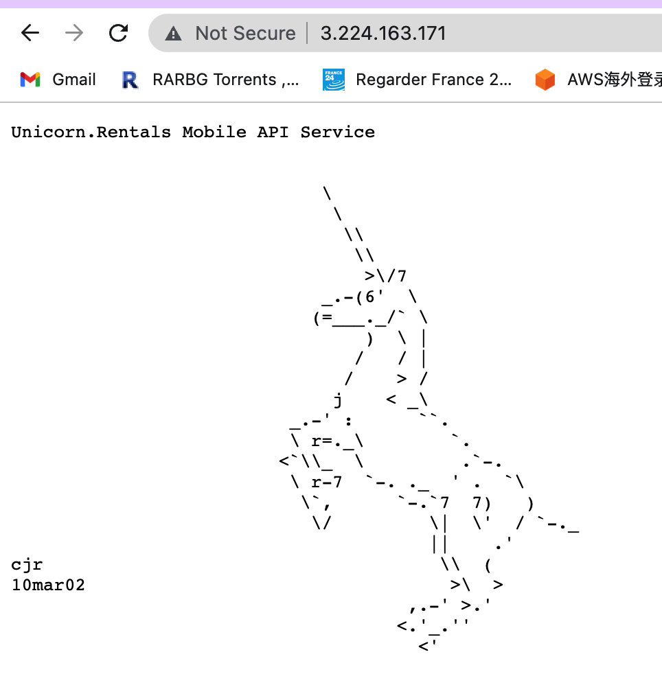

# create a bucket and upload resource
```
bucketregion=us-east-1
bucketname=
filename=
```
```
aws s3api create-bucket \
    --bucket $bucketname \
    --region $bucketregion
```
```
aws s3 cp $filename s3://$bucketname/ --region=$bucketregion --recursive
```

```
aws s3api list-objects --bucket=$bucketname --query 'Contents[].Key' --output text
```
# Network design
```
vpcid=$(aws ec2 describe-vpcs --query 'Vpcs[?IsDefault!=`true`].VpcId' --output text)
```

```
aws ec2 create-subnet --vpc-id=$vpcid --cidr-block 10.0.1.0/28 --availability-zone=us-east-1b

```


# Postgrel SQL配置命令
注意一定要用Linux 2的AMI，不能用2023版本，PS一定要用低版本的13版不能用高版本的，
```
sudo amazon-linux-extras install postgresql14
```
```
psql \
   --host=dbname.cluster-cdswaxxyyxn0.us-east-1.rds.amazonaws.com\
   --port=5432 \
   --username=postgres \
   --password \
   --dbname=unicorndb

```
```
CREATE TABLE IF NOT EXISTS unicorntable ( id SERIAL PRIMARY KEY,
requestid VARCHAR(255),
requestvalue VARCHAR(255),
hits INT );
```
```
select * from unicorntable;
```
```
\q
```
更新server.ini
```
"LogLocation" = "/home/ec2-user/"
"PgsqlHost" = "yourn.cluster-.us-east-1.rds.amazonaws.com"
"PgsqlPort" = "5432"
"PgsqlUser" = "postgres"
"PgsqlPass" = "unicorndb"
"PgsqlDb" = "unicorndb"
"PgsqlTable" = "unicorntable"
```

每次修改后再上传
```
aws s3 cp server.ini s3://jessica2023
```


# EC2 user data
```
#!/bin/bash
cd /home/ec2-user
aws s3 cp s3://jessica2023/root server
aws s3 cp s3://jessica2023/server.ini  server.ini
sudo chmod 777 server
sudo ./server
```
成功后出现下图

